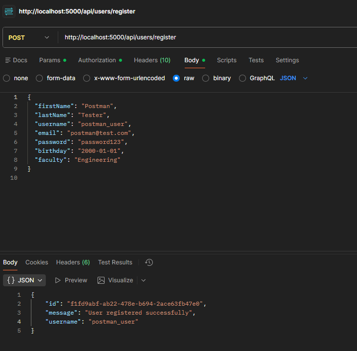
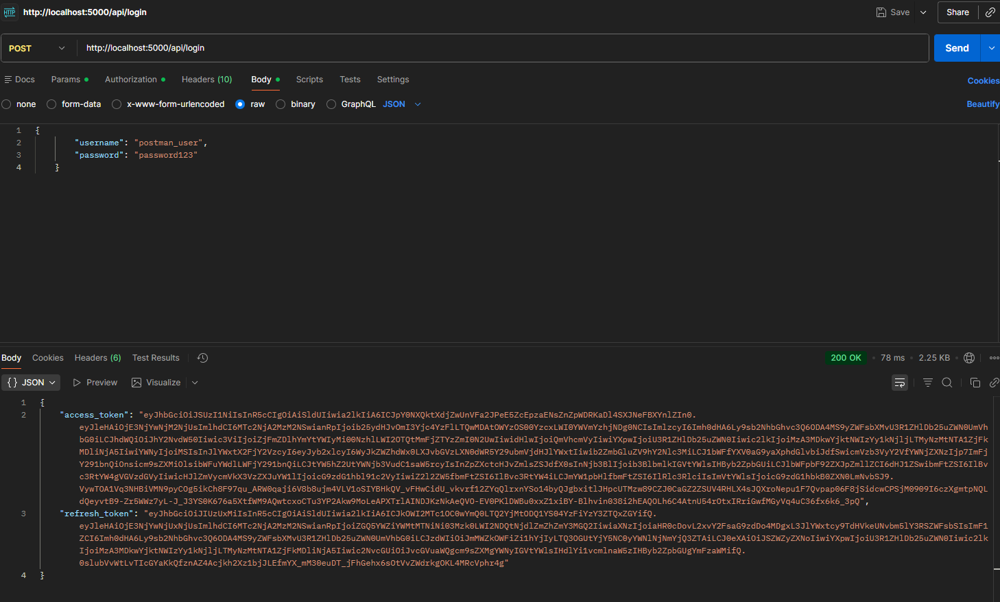
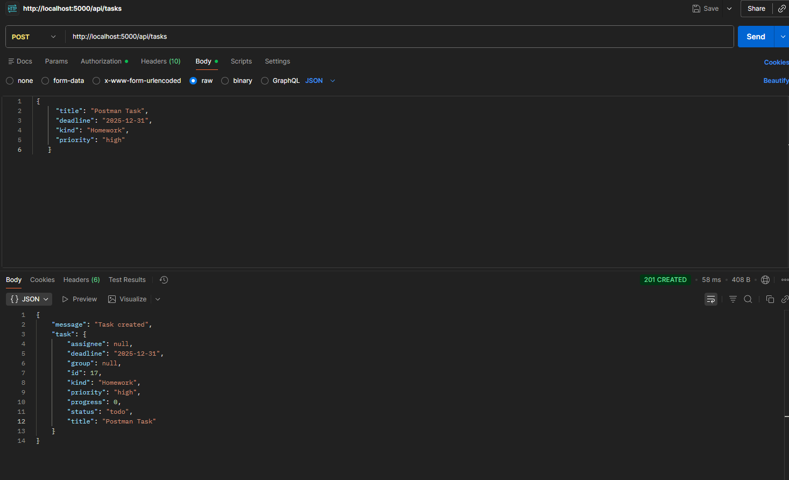
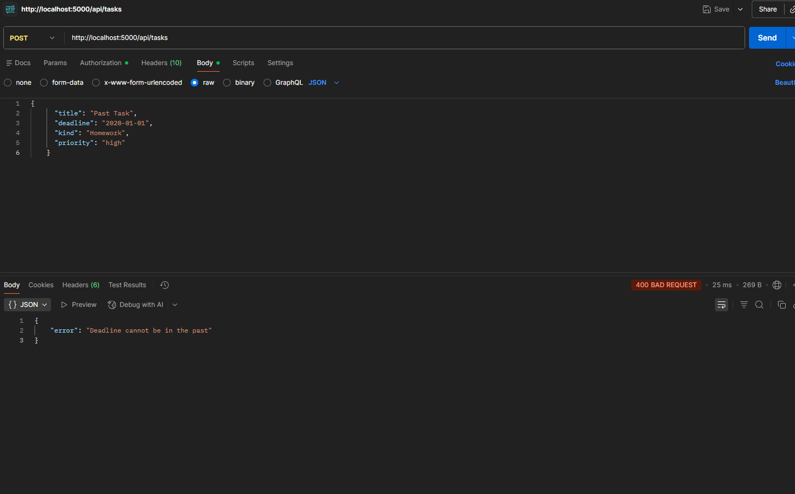

# Exercise 10: API Tesing


# 10.1 Reflect on your existing API Endpoint
## 10.1.1 Reflection on API Endpoints

Developed initially during Exercise 6 (Mock Testing) and refined subsequently, the API ensures separation of concerns by utilizing a Service Layer pattern. This allows the API endpoints (backend/api.py) to handle HTTP requests and responses while delegating business logic to backend/services.py.

### Operations Overview
The API meets the requirement of providing at least two operations for the main entities:

*   **Users**:
    *   **Create**: `POST /api/users/register` - Registers a new user in both Keycloak and the local database.
    *   **Retrieve**: `GET /api/users/<user_id>` - Fetches user details.
    *   **Update**: `PUT /api/users/<user_id>` - Updates user profile information.

*   **Tasks**:
    *   **Create**: `POST /api/tasks` - Creates a new task for the authenticated user.
    *   **Retrieve**: `GET /api/tasks` - Retrieves all tasks assigned to the user.
    *   **Update**: `PUT /api/tasks/<task_id>` - Updates task status, progress, or details.

*   **Groups**:
    *   **Create**: `POST /api/groups` - Creates a new study group.
    *   **Retrieve**: `GET /api/groups` - Lists all available groups.
    *   **Join**: `POST /api/groups/join` - Adds the user to a group.

## 10.1.2. Setup and Access

### Prerequisites
*   **Docker**: Required for PostgreSQL and Keycloak containers.
*   **Python 3.12**: For running the Flask backend.

### Starting the Backend

1.  **Start Infrastructure**:
    ```bash
    docker compose up -d
    ```
    This starts the PostgreSQL database and Keycloak authentication server.

2.  **Install Dependencies** (if not already installed):
    ```bash
    pip install -r backend/requirements.txt
    ```

3.  **Run the Application**:
    ```bash
    python -m backend.api
    ```
    The API will be accessible at `http://localhost:8000`.

## 10.1.3. API Reference

**Base URL**: `http://localhost:8000`

### Authentication
*   **Login**: `POST /api/login` (Body: `username`, `password`) -> Returns Tokens.

### Users
*   **Register**: `POST /api/users/register`
*   **Get Profile**: `GET /api/users/<user_id>` (Auth required)

### Tasks
*   **Create**: `POST /api/tasks` (Auth required)
*   **List**: `GET /api/tasks` (Auth required)


## 10.2 Manual Testing with Postman

Tool used: **Postman**

### 10.2.1 Setup (Register & Login)

**1. Register User**
*   **Method:** `POST`
*   **URL:** `http://localhost:8000/api/users/register`
*   **Body** (Select `raw` -> `JSON`):
    ```json
    {
      "firstName": "Postman",
      "lastName": "Tester",
      "username": "postman_user",
      "email": "postman@test.com",
      "password": "password123",
      "birthday": "2000-01-01",
      "faculty": "Engineering"
    }
    ```
*   **Send**. Expected Status: `201 Created`.




**10.2.2 Login**
*   **Method:** `POST`
*   **URL:** `http://localhost:8000/api/login`
*   **Body** (Select `raw` -> `JSON`):
    ```json
    {
        "username": "postman_user",
        "password": "password123"
    }
    ```
*   **Send**.
*   **Action:** Copy the `access_token` string from the response body.




### 10.2.3 Successful Request

**Create Task (Valid)**
*   **Method:** `POST`
*   **URL:** `http://localhost:8000/api/tasks`
*   **Authorization:** Select Type **Bearer Token** and paste the token from the login step.
*   **Body** (Select `raw` -> `JSON`):
    ```json
    {
      "title": "Postman Task",
      "deadline": "2025-12-31",
      "kind": "Homework",
      "priority": "high"
    }
    ```

**Outcome:**
*   **Status Code:** 201 Created
*   **Response:** JSON object with the created task.




### 10.2.4 Invalid Request (Error Handling)

**Create Task (Invalid Deadline)**
*   **Method:** `POST`
*   **URL:** `http://localhost:8000/api/tasks`
*   **Authorization:** Select Type **Bearer Token** and paste the token.
*   **Body** (Select `raw` -> `JSON`):
    ```json
    {
      "title": "Past Task",
      "deadline": "2020-01-01",
      "kind": "Homework",
      "priority": "high"
    }
    ```

**Outcome:**
*   **Status Code:** 400 Bad Request
*   **Response:** `{"error": "Deadline cannot be in the past"}`




## 10.3 Automated API Test Cases

To ensure the reliability and correctness of the API endpoints, automated test cases have been implemented using **pytest** and **unittest.mock**.

### Test Strategy
The tests focus on validating the behavior of the API endpoints in isolation. External dependencies such as the PostgreSQL database and the Keycloak authentication service are **mocked**. This ensures that tests run quickly and are not flaky due to network issues or external state.

**Key areas covered:**
*   **Success Scenarios**: Verifying that valid requests return the expected status codes (200/201) and JSON structures.
*   **Failure Scenarios**: Verifying that invalid input, missing authentication, or permission issues result in appropriate error codes (400, 401, 403, 404).
*   **Edge Cases**: Testing boundary conditions like past deadlines or missing optional fields.

### Source Code
The test cases are located in test_backend/test_api.py.

### How to Run the Tests

1.  **Ensure Dependencies are Installed**:
    Make sure `pytest` is installed.
    ```bash
    pip install pytest
    ```

2.  **Run the Tests**:
    Execute the following command from the project root directory:
    ```bash
    pytest test_backend/test_api.py
    or just execute `pytest` in the root folder
    ```


## 10.4 Load & Performance Testing
