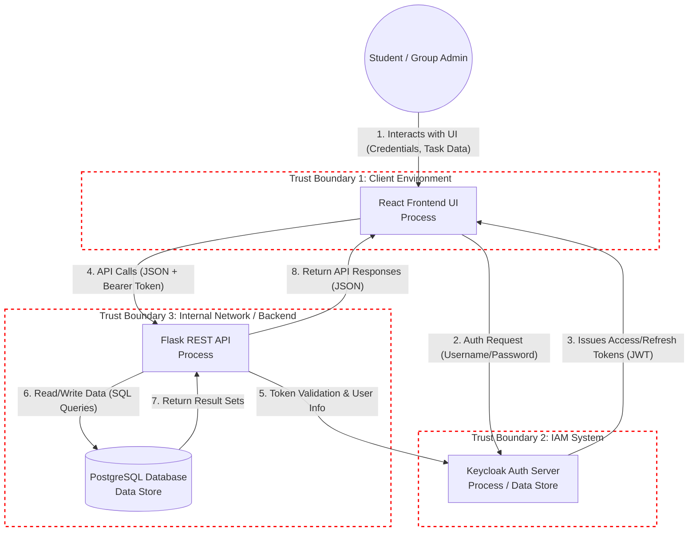

    <h>Tim Farnung, Dieter Grünke, Erik Sauer, Leonhard Schneider</h>

Projekt: StudyConnect

# Lab 4
Architecture Security Report: StudyConnect

## 1. Data Flow Diagram (DFD) & Trust Boundaries
The following Data Flow Diagram illustrates the core architecture of the StudyConnect application, including actors, processes, data stores, data flows, and Trust Boundaries.

**Identified Trust Boundaries:**
*   **Trust Boundary 1 (Client to Network):** Separates the user's local browser environment (React UI) from the open internet. Data residing here (like tokens in `localStorage`) is highly susceptible to client-side attacks like XSS.
*   **Trust Boundary 2 (Network to IAM):** Separates the public internet / application UI from the critical Identity and Access Management (Keycloak).
*   **Trust Boundary 3 (Network to Backend API & DB):** Separates the public network from the internal business logic (Flask) and data persistence layer (PostgreSQL). The backend must not trust incoming API requests and must validate all inputs and JWTs.

## 2. Critical Assets
For the Threat Modeling exercise, the following three primary assets have been identified which must be protected regarding Confidentiality, Integrity, and Availability:
1.  **Authentication Credentials & Tokens (High Sensitivity):** Keycloak admin credentials, client secrets, user passwords, and active JWT Session/Refresh Tokens. *If compromised, attackers can fully impersonate users or hijack the application.*
2.  **Personal Identifiable Information (PII) (Medium-High Sensitivity):** Student profile data including real names, email addresses, birthdays, and faculties. *Subject to GDPR (Data Minimization / Privacy requirements).*
3.  **Academic & Group Data (Medium Sensitivity):** Tasks, deadlines, study group assignments, and group chat notes. *If manipulated (Integrity loss), it disrupts the students' academic workflows and degrades trust in the app.*

## 3. Secure-by-Design Principles (Annotations)
The architecture incorporates several Secure-by-Design principles, though there is room for improvement:
*   **Separation of Concerns / Modularity (Applies to the whole DFD):** Authentication is heavily decoupled from the business logic. Keycloak handles identity brokering securely, meaning the Flask backend does not need to store or hash user passwords itself.
*   **Defense in Depth (Applies to TB_Backend):** The API is protected by multiple layers. The API first validates the Keycloak JWT (Authentication), and then the Service layer (should) validate if the user owns the task (Authorization) before generating an SQL query.
*   **Secure Defaults (Applies to Flask API):** Running Flask in production with `FLASK_DEBUG=False` and restricting CORS origins to the specific Frontend URL (rather than `*`) minimizes the attack surface.

## 4. Security Control Gap List & Mitigations
Based on previous architectural reviews, the following security gaps exist in the current DFD flows, along with proposed mitigations:

| Gap ID | Location in DFD | Data Flow / Asset | STRIDE Category | Specific Threat | Description of Missing Control | Proposed Mitigation |
| :--- | :--- | :--- | :--- | :--- | :--- | :--- |
| **GAP-01** | UI (TB_Client) | Flow 3 & 4 / JWT Tokens (Asset 1) | Spoofing / Information Disclosure | An attacker exploiting an XSS vulnerability steals the JWT from `localStorage` to hijack the user's session. | **Insecure Token Storage:** The React UI stores sensitive JWTs in `localStorage`, making them extractable via JS. | Transition to using `httpOnly`, `Secure` cookies for session management to protect against XSS token exfiltration. |
| **GAP-02** | UI -> API (Flow 4) | Flow 4 & 6 / Task Data (Asset 3) | Tampering / Elevation of Privilege | A malicious user modifies task IDs in the API request to edit/delete tasks of other users. | **Broken Object Level Auth (IDOR):** API lacks ownership checks on write operations (PUT/DELETE). | Implement strict ownership verification in `services.py`. Ensure `editor_user_id` matches the task's owner (SEC-REQ-10). |
| **GAP-03** | Config / Repositories | Repo / Credentials (Asset 1) | Information Disclosure | An attacker gains access to the repository and extracts the Keycloak client secret or DB password. | **Hardcoded Secrets:** Keycloak secrets and PostgreSQL default passwords are in `.env` and `docker-compose.yml`. | Remove secrets from the repo. Use a Secret Manager or GitHub Secrets for CI pipelines. Implement `Gitleaks`. |
| **GAP-04** | UI -> KC (Flow 2) | Flow 2 / PII & DB Resources (Asset 2) | Denial of Service | An attacker uses a script to flood the registration endpoint, exhausting DB resources or creating fake accounts. | **Lack of Anti-Automation:** The registration/login endpoints do not limit request rates. | Implement Rate Limiting at the API gateway level and integrate CAPTCHA on the React registration form (SEC-REQ-12). |
| **GAP-05** | UI -> API (Flow 4) | Flow 4 & 6 / Task Data (Asset 3) | Tampering | An attacker overrides protected fields (`user_id`, `group_id`) via API payload to hijack tasks. | **Mass Assignment:** The API maps client input directly to DB models without filtering. | Implement strict schema validation and ignore immutable fields during updates (SEC-REQ-05). |
| **GAP-06** | UI -> API (Flow 4) | Group Data & Privacy (Asset 3) | Elevation of Privilege | A user guesses a `group_id` and joins a private group without permission. | **Unauthorized Group Escalation:** The join endpoint does not validate the `invite_link`. | Enforce validation of the cryptographic `invite_link` alongside the `group_id` (SEC-REQ-11). |
| **GAP-07** | API <-> DB (Flow 6) | Group Notes / UI (Asset 3) | Tampering / Cross-Site Scripting (XSS) | A malicious user inputs a JavaScript payload into a task description, executing in others' browsers. | **Missing Input Sanitization:** Text fields are stored directly in the database without sanitization. | Implement server-side sanitization for text fields and ensure safe rendering in React. |
| **GAP-08** | API (TB_Backend) | API Server (TB_Backend) | Information Disclosure | An attacker triggers a server error to access the interactive Werkzeug console. | **Insecure Defaults:** Running the Flask app with `FLASK_DEBUG=True` or a dev server in production. | Ensure `FLASK_DEBUG=False` and use a production-ready WSGI server like Gunicorn (SEC-REQ-09). |