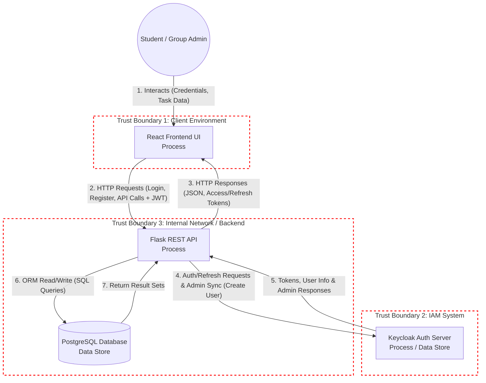

    <h>Tim Farnung, Dieter Grünke, Erik Sauer, Leonhard Schneider</h>

Projekt: StudyConnect

# Lab 5
## STRIDE for DFD

### STRIDE findings (per dataflow)

- Flow 1 — UI interaction (Spoofing / Tampering / Repudiation)
    - Threats: XSS leading to token theft; UI impersonation; forged client actions.
    - Gap: frontend stores tokens in `localStorage`; limited CSP and input sanitization.
    - Mitigations: move sensitive tokens out of JS-accessible storage; implement CSP, input sanitization and automated XSS tests.

- Flow 2 — HTTP request (Client → API) (Spoofing / Tampering / Info Disclosure / DoS)
    - Threats: stolen/replayed JWTs, tampered payloads (IDs/fields), brute-force and credential stuffing.
    - Gap: JWT lifecycle and token storage weak; missing rate-limiting on auth endpoints.
    - Mitigations: enforce HTTPS/HSTS, validate JWT claims server-side, add rate-limiting and strong server-side input validation.

- Flow 3 — HTTP response (API → Client) (Information Disclosure / Tampering / Repudiation)
    - Threats: over-broad JSON responses leaking PII or group membership; sensitive data cached or stored insecurely.
    - Gap: endpoints return full DB objects by default; client trusts returned data.
    - Mitigations: use serializers/DTOs to limit fields, add `Cache-Control: no-store` for sensitive endpoints, avoid sending membership metadata unless authorized.

- Flow 4 — Auth requests (API ↔ Keycloak) (Spoofing / Info Disclosure / DoS)
    - Threats: compromised service credentials, misconfigured scopes, refresh-flow replay.
    - Gap: secrets in environment variables rather than vault; missing protections on admin endpoints.
    - Mitigations: rotate service credentials, consider secrets manager, restrict admin endpoints (mTLS or IP allowlists), use token introspection.

- Flow 5 — Token & userinfo exchange (Spoofing / Info Disclosure / Elevation)
    - Threats: token replay, stolen refresh tokens, manipulated claims for privilege escalation.
    - Gap: access tokens returned to browser; refresh-token rotation absent.
    - Mitigations: use `HttpOnly`+`Secure`+`SameSite` cookies for refresh tokens, short-lived access tokens, refresh-token rotation and revocation endpoints; validate scopes/roles in API.

- Flow 6 — ORM read/write (API → DB) (Tampering / Elevation / Info Disclosure)
    - Threats: IDOR, mass assignment of `user_id`/`group_id`, SQL injection via raw queries.
    - Gap: partial service-side checks; some endpoints accept dangerous fields.
    - Mitigations: implement object-level authorization checks, use field whitelists/deserializers (Marshmallow/Pydantic), parameterized ORM queries, and explicit ownership checks in `update_task_service`.

- Flow 7 — Return result set (DB → API → Client) (Info Disclosure / Tampering / Repudiation)
    - Threats: overly permissive queries leaking group membership or private relations.
    - Gap: some endpoints return membership metadata by default.
    - Mitigations: apply projection filters, restrict result sets to authorized principals, consider Postgres row-level security for sensitive tables.

## STRIDE thread table
Assumption used for the qualitative risk matrix below: `Low / Medium / High` likelihood and impact are combined into `Low / Medium / High / Critical` risk. "CRA not permitted" is marked for risks that would be unacceptable to ship because they violate secure-by-design, secure-by-default, or denial-of-service protections.

| Flow | STRIDE category | Threat / abuse case | Impacted asset(s) | Existing control / gap | Risk |
| :--- | :--- | :--- | :--- | :--- | :--- |
| **1. UI interaction** | Spoofing, Tampering, Repudiation | Attacker manipulates form input or impersonates a legitimate student session in the browser. | Asset 1, Asset 3 | UI relies on browser context; no strong client-side trust boundary. | Medium |
| **2. HTTP request** | Spoofing, Tampering, Information Disclosure, DoS | Stolen JWTs, forged payloads, brute-force requests, and manipulated IDs reach the API. | Asset 1, Asset 2, Asset 3 | API authenticates with JWT, but token storage and request shaping remain weak. | High |
| **3. HTTP response** | Information Disclosure, Tampering, Repudiation | Over-broad responses expose PII or task data; unsafe client handling can trust unvalidated response data. | Asset 1, Asset 2, Asset 3 | Responses are JSON, but the frontend stores tokens in `localStorage` and consumes sensitive data directly. | High |
| **4. Auth requests** | Spoofing, Information Disclosure, DoS | Credential stuffing, refresh-token abuse, or exposure of Keycloak/admin credentials. | Asset 1, Asset 2 | Auth flow is proxied through the backend; secrets are env-backed, but rate limiting is missing. | High |
| **5. Token, user info** | Spoofing, Information Disclosure, Elevation of Privilege | Access/refresh tokens or userinfo are stolen, replayed, or used to impersonate another identity. | Asset 1, Asset 2 | Tokens are returned to the browser; current frontend stores the access token in `localStorage`. | Critical |
| **6. ORM read/write** | Tampering, Elevation of Privilege, Information Disclosure | IDOR, mass assignment, unauthorized task/group updates, or unvalidated group assignment alter persisted data. | Asset 2, Asset 3 | Some service-side checks exist, but task/group authorization is incomplete. | Critical |
| **7. Return result set** | Information Disclosure, Tampering, Repudiation | Database results are returned to a caller who should not see them, or the result set is used to infer private group membership. | Asset 2, Asset 3 | DB queries are mediated by services, but some endpoints still return too much data. | High |

### STRIDE summary by flow
1. UI interaction: spoofing of the browser session, tampering with input data, and lack of non-repudiation for client-side actions.
2. HTTP request: forged or replayed requests, tampered task/group identifiers, token theft, and request flooding.
3. HTTP response: leakage of task, group, or user data; trust in response content without sufficient validation.
4. Auth requests: credential stuffing, refresh-token misuse, and exposure of Keycloak or service-account secrets.
5. Token, user info: token replay, stolen token use, and identity spoofing across the trust boundary.
6. ORM read/write: IDOR, mass assignment, unauthorized persistence changes, and membership escalation.
7. Return result set: overbroad result sets and sensitive membership/data disclosure from backend responses.

## Risk Matrix
Assessment of likelihood * impact with qualitative risk matrix. Rows marked "Yes" in the CRA column are risks that should not be accepted in a CRA-aligned product baseline.

| ID | Threat | Likelihood | Impact | Risk level | CRA not permitted? | Rationale |
| :--- | :--- | :--- | :--- | :--- | :--- | :--- |
| **R-01** | Token theft from browser storage / XSS session hijack | High | High | Critical | Yes | A stolen access token lets an attacker act as the user and read or mutate private data. |
| **R-02** | IDOR on `PUT /api/tasks/<task_id>` | High | High | Critical | Yes | A malicious user can modify another user’s task by guessing or iterating task IDs. |
| **R-03** | Mass assignment on `user_id` / `group_id` | High | High | Critical | Yes | Protected fields can be overridden and move a task into a different ownership context. |
| **R-04** | Unauthorized group-member disclosure | Medium | High | High | Yes | Group membership and metadata reveal private collaboration structure and identities. |
| **R-05** | Covert group join by guessing `group_id` | Medium | High | High | Yes | An unauthorized user can enter a private group without proving possession of an invite link. |
| **R-06** | Registration flooding / brute-force requests | High | Medium-High | High | Yes | The system can be exhausted or filled with fake accounts without rate limiting or bot checks. |
| **R-07** | Hardcoded or exposed secrets | Medium | High | High | Yes | Leaked Keycloak or database credentials undermine the entire trust boundary. |
| **R-08** | Debug mode or verbose error exposure | Medium | High | High | Yes | Debug output can expose stack traces or interactive consoles in production. |
| **R-09** | Overbroad result sets from backend queries | Medium | Medium-High | Medium | No | Still a confidentiality issue, but less severe than direct identity takeover or persistence tampering. |
| **R-10** | Client-side repudiation / weak auditability | Medium | Medium | Medium | No | Important for incident response, but not a primary CRA-blocking risk by itself. |

## Mitigation Plan
Top 3 risks (mapped to the thread mitigated). Each row lists the Lab3 requirements it helps satisfy and concrete actions to implement.

| Risk ID | Thread mitigated | Lab3 requirement(s) | Mitigation actions |
| :--- | :--- | :--- | :--- |
| **R-01** | **5. Token, user info** (token theft / replay) | SEC-REQ-02, SEC-REQ-09 | Use `HttpOnly`, `Secure`, `SameSite` cookies for session tokens (avoid `localStorage`); implement short-lived access tokens + refresh-token rotation; implement logout/token revocation and server-side session invalidation; add CSP, input sanitization, and XSS tests to reduce client-side token theft. |
| **R-02** | **6. ORM read/write** (IDOR / unauthorized updates) | SEC-REQ-04, SEC-REQ-10 | Enforce object-level authorization in `update_task_service` (verify `editor_user_id` equals task owner or admin) before any DB write; add explicit ownership checks at the API layer; add unit/integration tests that attempt cross-user updates and assert 403 responses; log and alert repeated auth-failures. |
| **R-03** | **6. ORM read/write** (Mass assignment / protected fields) | SEC-REQ-05 | Implement strict request-schema validation and field whitelisting (reject or ignore `user_id`, `group_id` from client payloads on update); use a serialization library (e.g., Marshmallow/Pydantic) to deserialize allowed fields only; add tests that submit forged `user_id`/`group_id` and verify server ignores them. |

Short rationale: These three mitigations address the highest-rated confidentiality and integrity failures: token theft (R-01) mitigates identity takeover, and R-02/R-03 harden the persistence layer against unauthorized mutation and ownership tampering.