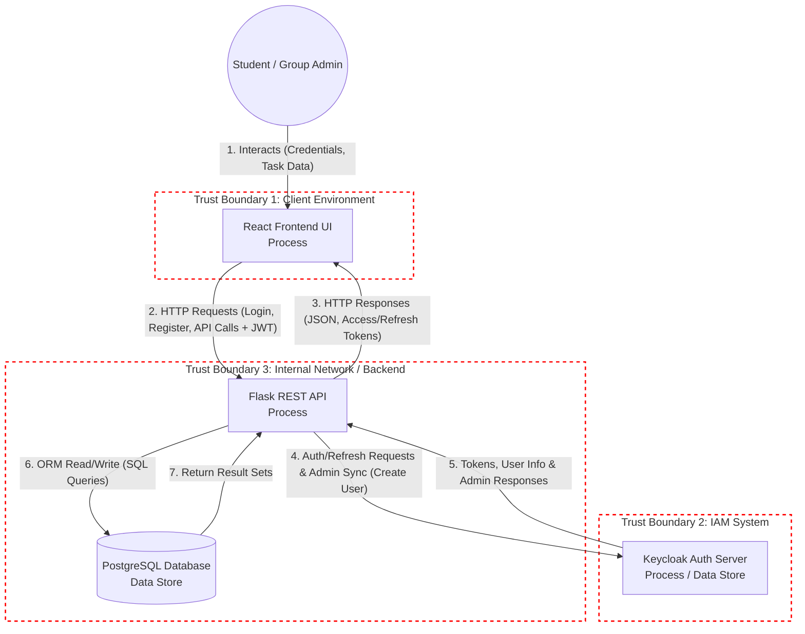

    <h>Tim Farnung, Dieter Grünke, Erik Sauer, Leonhard Schneider</h>

Projekt: StudyConnect

# Lab 5
## STRIDE for DFD

## STRIDE thread table
Assumption used for the qualitative risk matrix below: `Low / Medium / High` likelihood and impact are combined into `Low / Medium / High / Critical` risk. "CRA not permitted" is marked for risks that would be unacceptable to ship because they violate secure-by-design, secure-by-default, or denial-of-service protections.

| Flow | Trust Boundary(ies) | Diagram Elements | STRIDE category | Threat / abuse case | Impacted asset(s) | Existing control / gap | Risk |
| :--- | :--- | :--- | :--- | :--- | :--- | :--- | :--- |
| **1. UI interaction** | TB_Client | User, UI Process | Spoofing, Tampering, Repudiation | Attacker manipulates form input or impersonates a legitimate student session in the browser. | Asset 1, Asset 3 | UI relies on browser context; no strong client-side trust boundary. | Medium |
| **2. HTTP request** | TB_Client ↔ TB_Backend | UI Process, API Process | Spoofing, Tampering, Information Disclosure, DoS | Stolen JWTs, forged payloads, brute-force requests, and manipulated IDs reach the API. | Asset 1, Asset 2, Asset 3 | API authenticates with JWT, but token storage and request shaping remain weak. | High |
| **3. HTTP response** | TB_Backend ↔ TB_Client | API Process, UI Process | Information Disclosure, Tampering, Repudiation | Over-broad responses expose PII or task data; unsafe client handling can trust unvalidated response data. | Asset 1, Asset 2, Asset 3 | Responses are JSON, but the frontend stores tokens in `localStorage` and consumes sensitive data directly. | High |
| **4. Auth requests** | TB_Backend ↔ TB_IAM | API Process, Keycloak Process | Spoofing, Information Disclosure, DoS | Credential stuffing, refresh-token abuse, or exposure of Keycloak/admin credentials. | Asset 1, Asset 2 | Auth flow is proxied through the backend; secrets are env-backed, but rate limiting is missing. | High |
| **5. Token, user info** | TB_IAM ↔ TB_Backend | Keycloak Process, API Process | Spoofing, Information Disclosure, Elevation of Privilege | Access/refresh tokens or userinfo are stolen, replayed, or used to impersonate another identity. | Asset 1, Asset 2 | Tokens are returned to the browser; current frontend stores the access token in `localStorage`. | Critical |
| **6. ORM read/write** | TB_Backend | API Process, PostgreSQL Data Store | Tampering, Elevation of Privilege, Information Disclosure | IDOR, mass assignment, unauthorized task/group updates, or unvalidated group assignment alter persisted data. | Asset 2, Asset 3 | Some service-side checks exist, but task/group authorization is incomplete. | Critical |
| **7. Return result set** | TB_Backend | PostgreSQL Data Store, API Process | Information Disclosure, Tampering, Repudiation | Database results are returned to a caller who should not see them, or the result set is used to infer private group membership. | Asset 2, Asset 3 | DB queries are mediated by services, but some endpoints still return too much data. | High |

## Risk Matrix
Top 8 most critical risks (all marked CRA-not-permitted). Column "Flow(s)" indicates which data flow and STRIDE thread from the DFD introduces the threat.

| ID | Threat | Flow(s) | Likelihood | Impact | Risk level | CRA not permitted? | Rationale |
| :--- | :--- | :--- | :--- | :--- | :--- | :--- | :--- |
| **R-01** | Token theft from browser storage / XSS session hijack | 1, 5 | High | High | Critical | Yes | A stolen access token lets an attacker act as the user and read or mutate private data. |
| **R-02** | IDOR on `PUT /api/tasks/<task_id>` | 6 | High | High | Critical | Yes | A malicious user can modify another user's task by guessing or iterating task IDs. |
| **R-03** | Mass assignment on `user_id` / `group_id` | 6 | High | High | Critical | Yes | Protected fields can be overridden and move a task into a different ownership context. |
| **R-04** | Unauthorized group-member disclosure | 3, 7 | Medium | High | High | Yes | Group membership and metadata reveal private collaboration structure and identities. |
| **R-05** | Covert group join by guessing `group_id` | 2, 6 | Medium | High | High | Yes | An unauthorized user can enter a private group without proving possession of an invite link. |
| **R-06** | Registration flooding / brute-force requests | 2, 4 | High | Medium-High | High | Yes | The system can be exhausted or filled with fake accounts without rate limiting or bot checks. |
| **R-07** | Hardcoded or exposed secrets | 4 | Medium | High | High | Yes | Leaked Keycloak or database credentials undermine the entire trust boundary. |
| **R-08** | Debug mode or verbose error exposure | 3, 4 | Medium | High | High | Yes | Debug output can expose stack traces or interactive consoles in production. |

## Mitigation Plan
Top 3 risks (mapped to the thread mitigated). Each row lists the Lab3 requirements it helps satisfy and concrete actions to implement.

| Risk ID | Thread mitigated | Lab3 requirement(s) | Mitigation actions |
| :--- | :--- | :--- | :--- |
| **R-01** | **5. Token, user info** (token theft / replay) | SEC-REQ-02, SEC-REQ-09 | Use `HttpOnly`, `Secure`, `SameSite` cookies for session tokens (avoid `localStorage`); implement short-lived access tokens + refresh-token rotation; implement logout/token revocation and server-side session invalidation; add CSP, input sanitization, and XSS tests to reduce client-side token theft. |
| **R-02** | **6. ORM read/write** (IDOR / unauthorized updates) | SEC-REQ-04, SEC-REQ-10 | Enforce object-level authorization in `update_task_service` (verify `editor_user_id` equals task owner or admin) before any DB write; add explicit ownership checks at the API layer; add unit/integration tests that attempt cross-user updates and assert 403 responses; log and alert repeated auth-failures. |
| **R-03** | **6. ORM read/write** (Mass assignment / protected fields) | SEC-REQ-05 | Implement strict request-schema validation and field whitelisting (reject or ignore `user_id`, `group_id` from client payloads on update); use a serialization library (e.g., Marshmallow/Pydantic) to deserialize allowed fields only; add tests that submit forged `user_id`/`group_id` and verify server ignores them. |

Short rationale: These three mitigations address the highest-rated confidentiality and integrity failures: token theft (R-01) mitigates identity takeover, and R-02/R-03 harden the persistence layer against unauthorized mutation and ownership tampering.